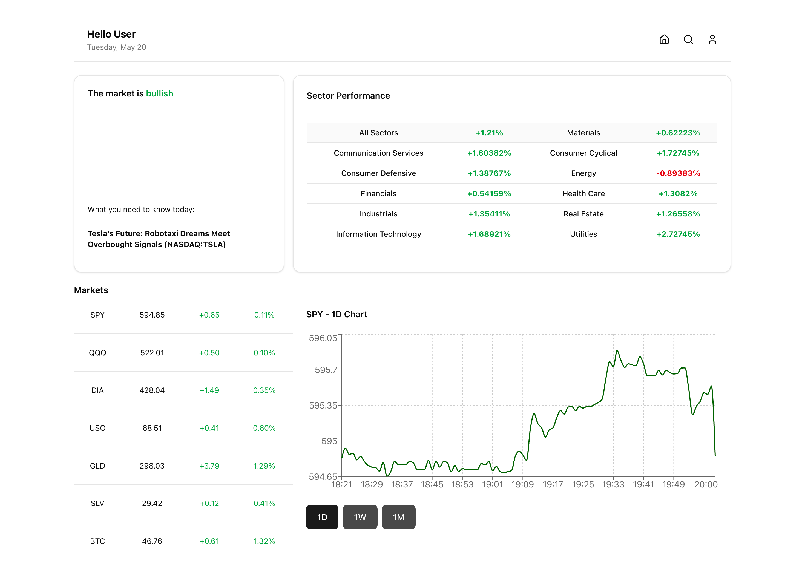

# AI-Powered Stock Market Dashboard


*Note: Screenshot might be from a previous version.*

## Overview

The **AI-Powered Stock Market Dashboard** is a modern, responsive web application designed to provide users with a comprehensive view of market data, personal portfolio tracking, and an AI assistant for natural language queries. It integrates real-time and historical data, offering insights into market trends, watchlist performance, and portfolio allocation. The AI assistant, powered by CopilotKit, allows users to interact with the dashboard's data conversationally.

---

## Features

- **Dynamic Portfolio Tracking:**
    - View current portfolio value.
    - Track daily gain/loss (amount and percentage).
    - Visualize portfolio allocation with a donut chart.
    - (Note: Portfolio holdings are currently hardcoded in `src/components/custom/Dashboard.tsx`.)
- **Market Overview:**
    - S&P 500 historical performance chart (data from Marketstack via backend).
    - Key metrics display (Portfolio Value, Day's Gain/Loss, S&P 500 quote, static Total Return & Portfolio Yield).
    - Total Market Volume (derived from SPY volume).
- **Watchlist & Live Prices:**
    - Customizable watchlist with bar chart visualization of current prices (data from Finnhub via backend).
    - Live price updates for selected commodities (e.g., Gold, Silver, USD/ZAR) via WebSocket (proxied through backend).
- **IPO Calendar:**
    - View upcoming IPOs for the next 30 days (data from Finnhub via backend).
- **AI Assistant (Powered by CopilotKit):**
    - Interact with your dashboard data using natural language. Ask questions about your portfolio, market trends, or specific data points.
    - Perform actions like searching the internet for financial news (powered by Tavily API via backend).

---

## Technologies Used

- **Frontend:**
    - React (with Vite)
    - TypeScript
    - Tailwind CSS
    - shadcn/ui
    - Recharts (for charts)
    - CopilotKit (React SDK for AI assistant UI)
- **Backend (`copilotkit-backend/`):**
    - Node.js
    - Express.js
    - CopilotKit (Runtime for AI actions and backend integration)
    - `ws` (for WebSocket proxy)
- **APIs (accessed via backend):**
    - Finnhub API (for stock quotes, IPO calendar, live prices via WebSocket)
    - Marketstack API (for S&P 500 historical EOD data)
    - OpenAI API (for AI assistant's language understanding, via CopilotKit)
    - Tavily API (for internet search action, via CopilotKit)

---

## Getting Started - Local Setup

Follow these steps to run the application locally on your machine. You will need to run two separate processes: the backend server and the frontend development server.

### Prerequisites

- [Node.js](https://nodejs.org/) (v16 or later recommended)
- npm package manager
- API keys from the following services:
    - **Finnhub:** For stock quotes, IPOs, and live prices.
    - **Marketstack:** For S&P 500 historical data.
    - **OpenAI:** For the AI assistant.
    - **Tavily:** For the internet search action.

### 1. Clone the Repository

```bash
git clone <your-repository-url>
cd <repository-name>
```

### 2. Backend Setup (`copilotkit-backend/`)

The backend server handles API requests, AI action processing, and proxies WebSocket connections.

1.  **Navigate to the backend directory:**
    ```bash
    cd copilotkit-backend
    ```
2.  **Install dependencies:**
    ```bash
    npm install
    ```
3.  **Configure Environment Variables:**
    Create a `.env` file in the `copilotkit-backend/` directory by copying the example file:
    ```bash
    cp .env.example .env
    ```
    Open the `.env` file and add your API keys:
    ```
    PORT=3001

    OPENAI_API_KEY="your_openai_api_key_here"
    TAVILY_API_KEY="your_tavily_api_key_here"
    FINNHUB_API_KEY="your_finnhub_api_key_here"
    MARKETSTACK_API_KEY="your_marketstack_api_key_here"
    ```
    (Note: The `PORT` for the backend defaults to 3001. If you change it, ensure the frontend calls and WebSocket URL reflect this.)

4.  **Start the backend server:**
    ```bash
    npm start
    ```
    You should see a message like `CopilotKit backend listening at http://localhost:3001`. Keep this terminal window open.

### 3. Frontend Setup (Project Root Directory)

The frontend is a Vite React application that displays the dashboard and AI interface.

1.  **Navigate to the project root directory** (if you were in `copilotkit-backend/`, use `cd ..`):
    ```bash
    # Ensure you are in the main project root
    ```
2.  **Install dependencies:**
    ```bash
    npm install
    ```
    *If you encounter peer dependency issues, you might need to use:*
    ```bash
    npm install --legacy-peer-deps
    ```
3.  **Start the frontend development server:**
    ```bash
    npm run dev
    ```
    This will usually open the application in your browser (e.g., at `http://localhost:5173`).

### Running the Application

Ensure both the backend server (in `copilotkit-backend/`) and the frontend server (in the root directory) are running simultaneously in separate terminal windows. Open your browser to the address provided by the Vite development server.

---
